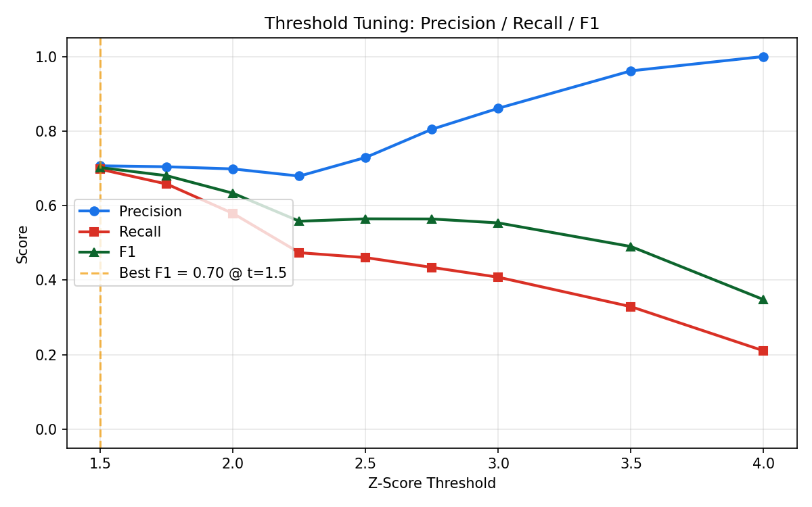

# Transaction Anomaly Detector

When working with financial records at Condata, there was a single shared master list to track all records and it was intended to be the source of truth, however, the records were incorrect enough that you could not fully rely upon them for manual reviews. There was no automated step between the raw data and a human reviewer to verify the accuracy of the information. That lack of an automated step has stayed with me; it seemed to be the perfect example of something that should be checked programmatically. This project represents my attempt to work through the design of such an automated process. This project performs z-score analysis on a per-client basis to identify statistically unusual clients -- based upon their individual transaction histories -- to reduce the risk of false positives in terms of identifying anomalies.

**Stack:** Python · pandas · NumPy · openpyxl

---

## How Does It Work

Each client's transaction record history is rated on its own merits. The z score for each transaction is calculated using that client's own mean and standard deviation, not the global mean, so both a small client and a large client will be compared to their own baseline. If clients have less than `--min-records` transactions they will be removed from scoring. If there are less than 5 records for a client then the standard deviation of those records cannot be used reliably as an estimate of the population standard deviation; therefore, flagged records will be categorized into two levels of severity:

| Severity | Condition |
|----------|-----------|
| HIGH | `\|z\|` > threshold × 1.5 |
| MEDIUM | `\|z\|` > threshold |

---

## Quickstart

```bash
pip install -r requirements.txt

# Generate sample data to test with
python generate_sample.py

# Run the detector
python detector.py sample_transactions.csv
```

Output is written to `flagged_transactions.xlsx` by default.

---

## Usage

```bash
python detector.py <input> [options]
```

| Flag | Default | Description |
|------|---------|-------------|
| `-o`, `--output` | `flagged_transactions.xlsx` | Output report path |
| `-t`, `--threshold` | `2.5` | Z-score cutoff for flagging |
| `--min-records` | `5` | Minimum transactions per client to include |

**Examples:**

```bash
# Default threshold
python detector.py transactions.csv

# Stricter threshold, custom output
python detector.py transactions.csv -t 3.0 -o review_queue.xlsx

# Lower minimum record requirement
python detector.py transactions.csv --min-records 3
```

---

## Input Format

CSV or Excel file with at minimum these columns (case-insensitive):

| Column | Type | Description |
|--------|------|-------------|
| `client_id` | string | Unique identifier per client |
| `date` | date | Transaction date |
| `amount` | numeric | Transaction amount |

Additional columns are passed through to the output unchanged.

---

## Output

Color-coded Excel report:

- **Red rows** -- HIGH severity (z-score > threshold x 1.5)
- **Yellow rows** -- MEDIUM severity (z-score > threshold)
- Sorted by absolute z-score descending so the most anomalous records are at the top
- Includes a `z_score` and `severity` column alongside the original data

---

## Threshold Tuning

The default threshold of 2.5 was selected by sweeping thresholds against labeled data. `generate_labeled.py` produces synthetic transactions with two categories of ground truth: injected anomalies (clear outliers at 3.5-5x baseline and borderline at 2-3x) and legitimate large transactions (equipment purchases, year-end settlements at 2.5-4x) that a reviewer would clear.

`tune_threshold.py` runs the detector at thresholds from 1.5 to 4.0 and computes precision, recall, and F1 at each:

```
 threshold  precision  recall     f1
      1.50     0.7067  0.6974 0.7020
      2.00     0.6984  0.5789 0.6331
      2.50     0.7292  0.4605 0.5645
      3.00     0.8611  0.4079 0.5536
      4.00     1.0000  0.2105 0.3478
```

Below 2.5, about 30% of flagged records are false positives (legitimate large transactions), creating unsustainable reviewer workload. Above 2.5, precision rises but recall drops sharply. The 2.5 threshold sits at the knee where precision begins climbing meaningfully while recall remains above 45%. The HIGH/MEDIUM severity classification handles the remaining ambiguity within each threshold.



```bash
python generate_labeled.py
python tune_threshold.py
```

---

## Streaming Mode

`stream_detector.py` processes transactions as a stream using Welford's online algorithm for rolling mean and variance. Each record is scored against the client's prior history and flagged immediately, without storing the full dataset in memory.

```bash
# pipe NDJSON from stdin
cat transactions.ndjson | python stream_detector.py

# read from file with custom threshold
python stream_detector.py --input transactions.ndjson --threshold 3.0
```

Each input line is a JSON object with `client_id`, `date`, and `amount`. Flagged records are printed to stdout as JSON. The `--warmup` flag (default: 5) sets the minimum records per client before scoring begins, matching the batch detector's `--min-records` default.

---

## Trade-offs

**Per Client Grouping vs Global Threshold**
Using a global z score would result in a $50,000 transaction being flagged for both a small client and a large client, which would produce irrelevant results. By using a per client group by client_id each client will be compared to their own history.

**Why Use Z-Score Instead Of IQR Or Isolation Forest**
Z-Score can be interpreted and explained to a non-technical reviewer at the data sizes commonly found in accounting work flows (10s to 100s of transactions per client). While isolation forest would provide a better solution at larger scales or when there are multiple input variables it would also add additional complexity that is not warranted in this use case.

**Default Threshold Value of 2.5**
Selected empirically via the threshold sweep above. While a z-score of 3.0 is the generally accepted value in academic research, it misses too many real anomalies (recall drops to 0.41). A threshold of 2.5 captures more cases while the high/medium flag designation lets reviewers triage the additional flags.
